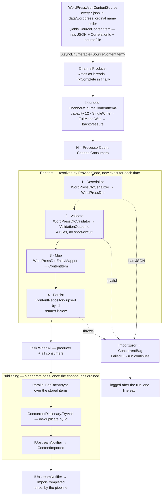
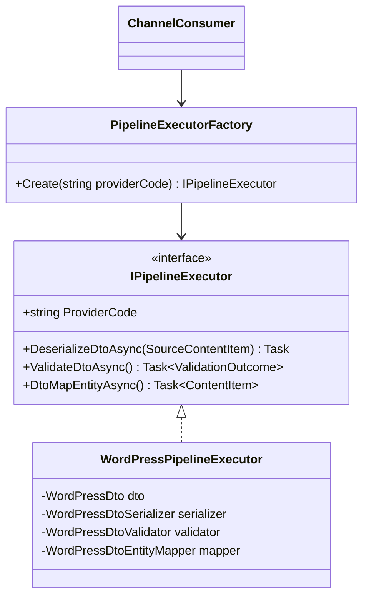

# Implementation Plan — WCMS Content Import

**Status: v1 done.** `dotnet build` and `dotnet test` are green (65 tests), and
`dotnet run` demonstrates an import end to end.

This document started as a forward-looking design. It is now groomed to record what was
*actually* built, where v1 departs from the original design and why, and what a v2 would pick
up. The gap between the two is deliberate and is some of the better interview material here —
every departure below was a decision, not an oversight.

Ubiquitous language lives in [CONTEXT.md](./CONTEXT.md). Decisions live in
[docs/adr/](./docs/adr/). How to run it lives in [README.md](./README.md).

---

## How this was built

Not designed up front and handed over. Built **in small steps, together** — I set the direction
and reviewed each piece; Claude drafted the code and the tests; we argued about the trade-offs
before moving on. `dotnet build` and `dotnet test` had to pass before a step counted as done.

The point of working this way was never speed. It was that I have to **present and defend this
live**, so I need to be able to explain every line. A design I did not argue my way through is a
design I cannot defend.

The actual sequence, from the commit history:

| # | Step | Commit |
|---|---|---|
| 0 | Scaffold — five projects, three tiers, the architecture test | `7cd3ede` |
| 1 | Domain — `ContentItem` | `e7b635d` |
| 2 | Test data, and the decisions behind it | `b4a1d90`, `f169b4d` |
| 3 | First working slice, source → pipeline → console | `3b6318f` |
| 4 | Repository — persistence and idempotent upsert | `d4d779d` |
| 5 | Multiple exports, and the ordering rule | `71c7ec1` |
| 6 | Upstream notification — the events and the port | `06917b1` |
| 7 | Console output, cancellation, polish | `19ede1f`, `dd3169e`, `ac2ad2a` |
| 8 | WordPress sample exports, console colours | `7d35aee` |
| 9 | README, cleanup | `28b498f`, `09582ff` |

---

## What v1 actually contains

```
ContentImporter.sln
Directory.Build.props                    net8.0, nullable, implicit usings, warnings-as-errors

src/
├── ContentImporter.Console/             → Application, Infrastructure
│   ├── Program.cs                       composition root — the ONLY place concretes are named
│   ├── Logging/                         ImportConsoleFormatter
│   └── data/wordpress/                  the five sample exports, copied next to the binary
│
├── ContentImporter.Domain/              → (no project references)
│   └── Entities/                        ContentItem
│
├── ContentImporter.Application/         → Domain
│   ├── ContentProviders/
│   │   ├── ContentSource/               IContentSource, SourceContentItem
│   │   ├── Dtos/                        WordPressDto (+ taxonomy, postmeta)
│   │   ├── WordPress/                   JsonContentSource, DtoSerializer, DtoValidator,
│   │   │                                DtoEntityMapper, PipelineExecutor
│   │   ├── IPipelineExecutor             the non-generic seam
│   │   ├── PipelineExecutorFactory       ProviderCode → executor
│   │   ├── IDtoSerializer / IDtoValidator / IDtoEntityMapper
│   │   └── ValidationOutcome
│   ├── Pipelines/                       ContentImporterChannel, ChannelProducer,
│   │                                    ChannelConsumer, ImportPipeline,
│   │                                    ImportPipelineOptions, ImportResult
│   ├── Publishers/                      ContentPublisher
│   ├── Notifications/                   IUpstreamNotifier, ImportEvents
│   └── Repositories/                    IContentRepository
│
└── ContentImporter.Infrastructure/      → Application (Domain transitively)
    ├── Repositories/                    SqliteContentRepository, InMemoryContentRepository
    └── Notifications/                   ConsoleUpstreamNotifier

tests/
└── ContentImporter.Tests/               65 tests
```

## The pipeline as built



**Why publishing is a separate pass.** Storing content and making it available are different
things, and the brief says Upstream Systems hear when content is *available*. Splitting them also
shows a second concurrency shape — `Parallel.ForEachAsync` over a fixed collection, versus the
channel's producer/consumer. The cost is real and worth admitting: every item is held in a
`ConcurrentBag` until the channel drains, so this stage is O(items), not O(capacity). A fully
streaming version publishes inline and gives that up.

---

## Where v1 departs from the original plan

| Planned | Built | Why |
|---|---|---|
| Value objects `ExternalReference`, `LanguageTag`, `ContentType`; `Result<T>`, `DomainError` | `ContentItem` only — a record with `required init` properties and plain strings | Simplicity rule. With one provider they added ceremony, not safety |
| `CanonicalContent` as a distinct shape, plus a canonical-validation stage | DTO maps straight to `ContentItem` | One provider means canonical and domain coincide. The seam to reintroduce it is the mapper |
| Enrichment — composite enrichers, caching lookup decorator | Not built | No Master Data in the demo, so there was nothing to enrich from |
| `SourceProviderAdapter<TDto>` + `IProviderAdapterRegistry` as a `FrozenDictionary` | `IPipelineExecutor` (non-generic) + `PipelineExecutorFactory` (a `switch`) | Same idea — close the generic behind a non-generic seam — with fewer moving parts. See below |
| No DI container; wire by hand | `Microsoft.Extensions.Hosting`, `AddSingleton` for the repository and the notifier | Reversed. It brings `ILogger` and the standard host, and the composition root still names every concrete in one file |
| No NuGet beyond xunit | Also `Microsoft.Extensions.Hosting`, `Microsoft.Data.Sqlite` | Reversed, twice, deliberately — SQL was a listed nice-to-have |
| `InMemoryContentRepository` | Both; `Program.cs` registers the SQLite one | The pair *is* the demonstration: swapping them is one line and nothing recompiles |
| `IEventPublisher` | `IUpstreamNotifier` | Resolves open question 2 in favour of CONTEXT.md's vocabulary |
| `ArrayPool<byte>` payloads, `Utf8JsonReader` streaming, "`JsonDocument.Parse` is not an option" | `JsonDocument.ParseAsync`, one export loaded whole, raw JSON carried as `string` | Reversed. The simplicity rule outranks it for a demo; the shortcut is named in a one-line comment and stays a talking point |
| Publish inline as stage 8 | A separate pass after the channel drains | See above |
| Second provider, legacy XML | Not built | The extension point is demonstrated by the factory and the ports; a thin second provider would have shown little more |
| Export acknowledged, file moved to `processed/` | Not built | Open question 1 was never settled — see below |
| `SingleReader = false` | `SingleReader = MaxDegreeOfParallelism == 1` | Correct in general, and lets a single-consumer configuration take the faster path |
| Fixtures in `data/air-asia/` | Five `word-press-*.json` under `src/ContentImporter.Console/data/wordpress/` | Rebuilt around the WordPress provider; the old fixtures were deleted |
| CI workflow | Not built | The one deliverable from CLAUDE.md still outstanding |

### The generic bridge, as it ended up

The problem was real and did not go away: `TDto` differs per provider, the pipeline holds a
`ProviderCode` string at runtime, and resolving separately-typed generic interfaces from a
non-generic loop does not compile.



`WordPressPipelineExecutor` closes the generic — it names `WordPressDto` internally and exposes
none of it. The consumer sees only `IPipelineExecutor`. Adding a provider is one sealed class plus
one arm in the factory.

One trade this shape forces, worth being able to defend: the executor **holds the current item's
DTO in a field** across its three calls, so it is stateful and the factory returns a *new instance
per item*. A stateless `Adapt(record) → result` signature would allow one shared instance, at the
cost of the three-step shape being visible in the pipeline. Cheap allocation, clearer stages.

---

## Deliberately out of scope

**Cross-reference resolution** — see
[ADR-0002](./docs/adr/0002-order-independent-reference-resolution.md). Retry and deferral are both
out; arrival order is unreliable at three independent levels, so any fix has to be
order-independent.

**Change detection.** Upsert by `Id` makes a re-import idempotent *in storage*, but the pipeline
still publishes `ContentImported` for every item, so re-running an export notifies Upstream Systems
about content that did not change. Survivable — at-least-once with idempotent consumers is the
normal contract — but the claim "the import is idempotent" needs that qualifier said out loud. The
fix is a content fingerprint, an upsert reporting Inserted/Updated/Unchanged, and publishing only
on change.

**Streaming reads.** One export is loaded whole. Named in a comment where it happens.

`ImportPipelineOptions` therefore stays at two knobs: `MaxDegreeOfParallelism`, `ChannelCapacity`.

---

## Patterns, and where each earns its place

| Pattern | Where | What it buys |
|---|---|---|
| Producer/consumer | `Channel<SourceContentItem>` | Backpressure — the channel is O(capacity), not O(export) |
| Strategy | `IContentSource`, `IDtoSerializer`, `IDtoValidator`, `IDtoEntityMapper` | A new provider adds classes, edits none |
| Bridge | `WordPressPipelineExecutor` behind `IPipelineExecutor` | Per-provider DTO types without generics leaking into the pipeline |
| Factory | `PipelineExecutorFactory` | `ProviderCode` → the right executor |
| Pipes and filters | Deserialize → validate → map → persist | Each stage has one reason to change |
| Repository | `IContentRepository` | Swap SQLite for in-memory; Application and Domain don't recompile |
| Observer / pub-sub | `IUpstreamNotifier`, `ContentPublisher.ContentPublished` | Upstream Systems learn content is available |
| Result object | `ValidationOutcome` | Expected failures aren't exceptions — no throw on the hot path |
| Claim-check | `ContentImported.BodyPreview` | The event says what happened; it doesn't ship the payload |

---

## What is tested

65 tests, xunit, hand-rolled fakes, no mocking framework.

| Area | Covers |
|---|---|
| `WordPressJsonContentSourceTests` | Every export read, ordinal name order, mtime ignored, source file recorded, missing folder |
| `WordPressDtoSerializerTests` | Field binding, absent and null fields, bad JSON |
| `WordPressDtoValidatorTests` | All four rules, and that they accumulate rather than short-circuit |
| `WordPressDtoEntityMapperTests` | Id derivation, date parsing, the `0000-00-00` placeholder |
| `SqliteContentRepositoryTests` | Insert, idempotent upsert, concurrent writes, round-trip |
| `UpstreamNotificationTests` | One event per item, one run event, shared run id, preview not payload |
| `ArchitectureTests` | Domain and Application free of transport/storage assemblies; Domain depends on no sibling |

Gaps worth naming before someone else names them: **no cancellation test**, **no
failing-source-mid-stream test**, and no high-parallelism load test. All three are in CLAUDE.md's
testing list and none of them exist.

---

## v2 backlog

Ordered by what I would do first.

1. **CI workflow** — restore, build, test. The last unbuilt item from the original brief.
2. **The three missing tests above** — cancellation, failing source, high parallelism.
3. **Decide what `ImportResult.Imported` counts.** Today it counts successful upserts, so
   re-importing 2 of 10 items reports 12. Distinct-items or inserted-vs-updated would both read
   better; either changes the contract and the notification tests.
4. **Streaming reads** — `Utf8JsonReader` over `JsonDocument`, so a large export is genuinely O(1).
5. **Change detection** — fingerprint, upsert reporting Unchanged, publish only on change.
6. **A second provider** — XML, to prove extension costs no Application edits.
7. **Transactional outbox** — the repository write and the publish are not one transaction today;
   a crash between them stores content nobody upstream hears about.

## Open questions

1. **When is an Export acknowledged?** Moving the file or committing the offset after a run with
   12 failures in 100,000 either loses those 12 or re-imports 99,988. Unanswered, and the reason
   nothing in v1 acknowledges anything.
2. ~~**`IEventPublisher` vs `IUpstreamNotifier`**~~ Resolved: `IUpstreamNotifier`, following
   CONTEXT.md.
3. ~~**Events in `Domain/Events/`?**~~ Resolved: both live in `Application/Notifications/`.
   `ImportCompleted` describes an Import Run — an application process, not a content concept — and
   `ContentImported` addresses systems outside our boundary.
4. **Does the repository expose `IQueryable`?** In tension with "easy DB change" — `IQueryable`
   leaks what a given provider can and cannot translate.
5. **Source fails mid-stream** (truncated export at record 40k of 100k) — throw, or return a
   partial `ImportResult`? Today the producer records the failure and lets already-queued items
   finish, which is a third answer nobody chose deliberately.
