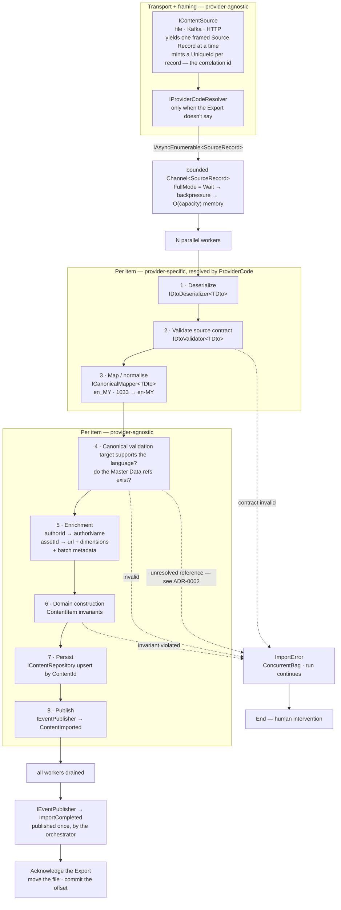
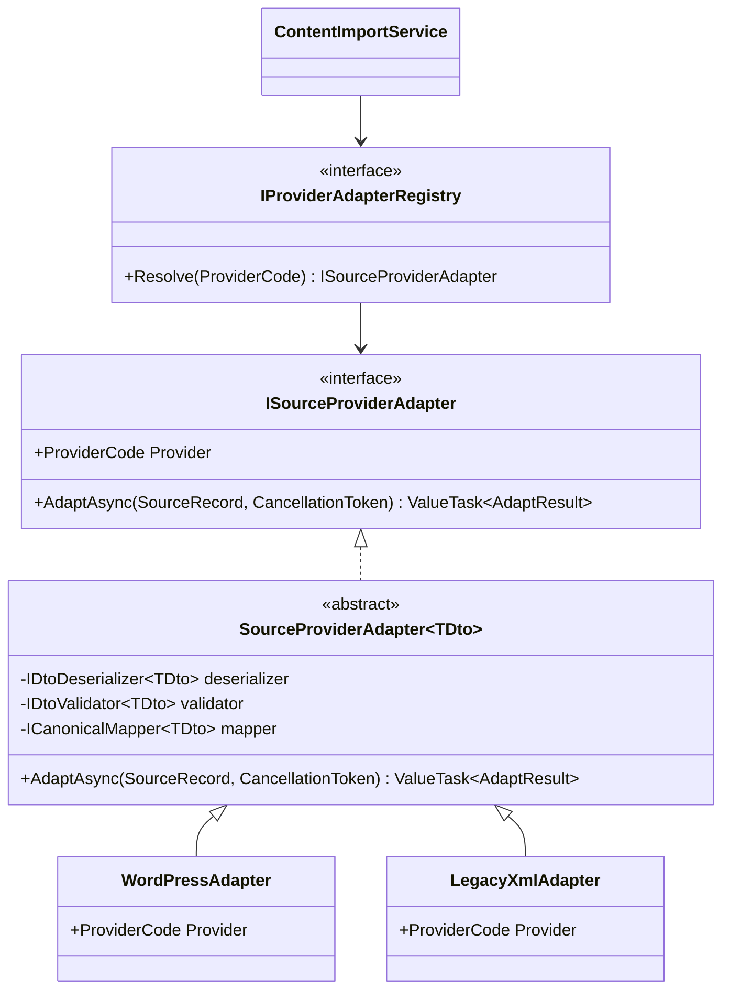

# Implementation Plan — WCMS Content Import

Ubiquitous language lives in [CONTEXT.md](./CONTEXT.md). Decisions live in [docs/adr/](./docs/adr/).

## Solution layout — AGREED (see [ADR-0001](./docs/adr/0001-four-projects-three-tiers.md))

```
ContentImporter.sln
Directory.Build.props                     net8.0, nullable, implicit usings, warnings-as-errors

src/
├── ContentImporter.Console/              → Application, Infrastructure, Domain
│   └── Program.cs                        composition root — the ONLY place concretes are named
│
├── ContentImporter.Domain/               → (no project references)
│   ├── Entities/                         ContentItem
│   ├── ValueObjects/                     ExternalReference, LanguageTag, ContentType
│   └── Results/                          Result<T>, DomainError
│
├── ContentImporter.Application/          → Domain
│   ├── Importing/                        ContentImportService, ImportOptions,
│   │                                     ImportResult, ImportError, ImportContext
│   ├── Events/                           ContentImported, ImportCompleted
│   ├── Providers/                        ProviderCode, ISourceProviderAdapter,
│   │                                     SourceProviderAdapter<TDto>, IProviderAdapterRegistry
│   ├── Canonical/                        SourceRecord, CanonicalContent
│   ├── Validation/                       ICanonicalValidator, ValidationResult
│   ├── Enrichment/                       IEnricher
│   └── Interfaces/                       IContentSource, IContentRepository, IEventPublisher,
│                                         IDtoDeserializer<T>, IDtoValidator<T>,
│                                         ICanonicalMapper<T>
│
└── ContentImporter.Infrastructure/       → Domain, Application
    ├── Sources/                          FileContentSource (+ JSON / XML framing)
    ├── Providers/
    │   ├── WordPress/                    WordPressPostDto, deserializer, validator, mapper
    │   └── LegacyXml/                    LegacyArticleDto, deserializer, validator, mapper
    ├── Enrichment/                       AuthorEnricher, AssetEnricher, BatchMetadataEnricher
    ├── Persistence/                      InMemoryContentRepository
    └── Messaging/                        InProcessEventPublisher

tests/
└── ContentImporter.Tests/                → all four
```

## The pipeline



**Two things moved from the earlier plan, deliberately:**

`IContentSource` is now **transport plus framing only** — it knows how to reach the Export and
how to cut it into records, not how to interpret them. `JsonContentSource` / `XmlContentSource`
stop being "sources" and become framing strategies plus per-provider deserializers. This is what
lets Kafka slot in for free: a broker frames records for you, so only the transport differs.

Framing still has to be format-aware — you cannot split a JSON array into elements without a
JSON reader — so framing yields `SourceRecord` carrying an unparsed `ReadOnlyMemory<byte>` (or
`JsonElement`) slice. **Binding** that slice to a provider's `TDto` is the separate, provider-keyed
step.

## Deliberately out of scope — see [ADR-0002](./docs/adr/0002-order-independent-reference-resolution.md)

**Retry** and **deferral** are both out. An Unresolved Reference is recorded as an `ImportError`
like any other per-item failure and the run continues.

The reasoning goes in a comment at the exact line where the reference check happens — the reader
meets the analysis where the problem lives, not in a document they may never open. That comment
is also the prompt for the conversation: arrival order is unreliable at three levels (the Source
Provider's own export order, partition-scoped ordering, and our own parallel workers), so any
fix has to be order-independent. Deferral rounds, two passes, and advisory-only reconciliation
are the three candidates, written up in the ADR.

`ImportOptions` therefore stays at two knobs: `MaxDegreeOfParallelism`, `ChannelCapacity`.

**Change detection** is out too. Upsert by `ExternalReference` makes re-import idempotent *in
storage*, but the pipeline still publishes `ContentImported` for every item — so re-running an
Export notifies Upstream Systems about content that did not change. That is survivable, since
at-least-once delivery with idempotent consumers is the normal contract, but the claim "the
import is idempotent" needs the qualifier said out loud. The fix — a content fingerprint on
`ContentItem`, an upsert that reports Inserted/Updated/Unchanged, and publishing only on change —
is written up in a comment on `ContentItem` rather than built.

## The generic bridge — the one genuinely tricky bit

`TDto` differs per provider (`WordPressPostDto`, `LegacyArticleDto`, …). The pipeline holds a
`ProviderCode` at runtime and cannot name the type. Resolving three separately-typed generic
interfaces from a non-generic loop does not compile.



The abstract base **closes the generic**; `TDto` never escapes past it. The pipeline sees only
the non-generic `ISourceProviderAdapter`. Adding a provider is one sealed class plus one
registry entry — no edit anywhere in Application.

Registry is a `FrozenDictionary<ProviderCode, ISourceProviderAdapter>` built once in the
composition root: in-box with .NET 8, no NuGet, and optimised for the read-many/write-never
access this has.

## Patterns, and where each one earns its place

| Pattern | Where | What it buys |
|---|---|---|
| Producer/consumer | `Channel<SourceRecord>` | Backpressure — peak memory is O(capacity), not O(Export) |
| Strategy | `IContentSource`, `IDtoDeserializer`, `IDtoValidator`, `ICanonicalMapper` | A new Source Provider adds classes, edits none |
| Bridge | `SourceProviderAdapter<TDto>` behind `ISourceProviderAdapter` | Per-provider DTO types without generics leaking into the pipeline |
| Registry / Abstract Factory | `IProviderAdapterRegistry` | `ProviderCode` → the right adapter, one lookup |
| Pipes and filters | The ordered stage sequence | Each stage has one reason to change |
| Composite | `CompositeEnricher`, `CompositeCanonicalValidator` | Many enrichers look like one to the pipeline |
| Decorator | `CachingMasterDataLookup` | Cross-cutting caching without touching the lookup |
| Repository | `IContentRepository` | Swap the store; Domain and Application don't recompile |
| Observer / pub-sub | `IEventPublisher` | Upstream Systems learn content is available |
| Result object | `ValidationResult`, `AdaptResult` | Expected failures aren't exceptions — no throw on the hot path |

## Build order

Each step: **I design it → you write the skeleton → I review → repeat → next step.**
`dotnet build` and `dotnet test` must pass before a step is done.

| # | Step | Notes |
|---|---|---|
| 0 | ✅ Scaffold | 5 projects, `Directory.Build.props`, the architecture test |
| 1 | Domain | `ContentItem`, the three value objects, `Result<T>` |
| 2 | Application model | `SourceRecord`, `CanonicalContent`, `ProviderCode`, `ValidationResult`, `ImportOptions/Result/Error` |
| 3 | Ports + generic bridge | The interfaces, `SourceProviderAdapter<TDto>`, the registry |
| 4 | Repository | `InMemoryContentRepository` |
| 5 | Publisher | `InProcessEventPublisher` |
| 6 | Pipeline | 6a skeleton · 6b producer · 6c consumers · 6d error handling |
| 7 | Canonical validation | Language support, Master Data references |
| 8 | Enrichment | Composite, plus the caching lookup decorator |
| 9 | Provider A — WordPress / JSON | End to end: framing, DTO, deserializer, validator, mapper, adapter |
| 10 | Provider B — legacy XML | Deliberately thin. Its job is to prove OCP with zero Application edits |
| 11 | Console | Composition root, synthetic Export, visible events |
| 12 | CI + README | |

## Decisions taken

- **Bounded channel over `Parallel.ForEachAsync`** — `FullMode = Wait` gives real backpressure, so
  peak memory is O(capacity) regardless of Export size, and the producer/consumer seam stays under
  our control for per-item error isolation.
- **`SingleWriter = true, SingleReader = false`** — one producer, N consumers.
- **No DI container.** `Microsoft.Extensions.DependencyInjection` is a NuGet package for a console
  `net8.0` app, and CLAUDE.md forbids non-test packages. The composition root wires by hand and the
  registry is a `FrozenDictionary`. This is also the better interview answer — you can explain how
  resolution works instead of saying "the container does it".
- **`InProcessEventPublisher`, not `ServiceBusEventPublisher`** — no real broker, per CLAUDE.md. The
  port and the `Messaging/` folder are shaped so the real one drops in beside it.
- **Validation failures are results, not exceptions** — expected failures on a hot path shouldn't
  cost a throw. Exceptions stay for the genuinely exceptional.
- **`SourceRecord` payloads come from `ArrayPool<byte>`** and are returned after adaptation — the
  concrete answer to "memory allocations and management".
- **`MaxDegreeOfParallelism` defaults to `Environment.ProcessorCount` but is not fixed to it.**
  That figure is right for CPU-bound work; these workers spend their time *awaiting* enrichment
  lookups and persistence, so the useful setting is well above core count. On 8 cores with a 20 ms
  lookup, 8 workers gives ~400 items/sec and 64 gives ~3,200 at almost no extra CPU. The default
  is conservative on purpose, and being able to say why is the point.
- **A `UniqueId` is minted per Source Record at ingest** and rides with it to the end — the
  correlation id that makes a failed item traceable through the log.
- **The Export is acknowledged only after `ImportCompleted`** — the file moves to `processed/`
  rather than being deleted, so a demo run is repeatable and nothing is destroyed.
- **One provider built fully, one built thin** — the second provider exists to demonstrate that
  extension costs no edits to Application, not to be complete.
- **No `global.json`** — only SDK 10.0.300 is installed here; the .NET 8.0.29 runtime is present, so
  `net8.0` targeting and test execution work. CI pins 8.0.x explicitly.

## Test data

Exports live in `data/air-asia/`. Both share one shape — an object with `exportMetadata`,
`items` and `assets` — so one reader handles both. `exportMetadata.sourceSystem` is where
`ProviderCode` comes from, and `exportMetadata.defaultLanguage` is the fallback when an item
omits its language.

| Fixture | Items | What it is for |
|---|---|---|
| `cms.json` | 14 | Realistic happy path. Every item valid except `component-5001`. |
| `cms-with-defects.json` | 14 | One seeded defect per item, each annotated with `_expected` and `_why`. Proves per-item error isolation. |

**`items` is a nested array, which rules out `JsonSerializer.DeserializeAsyncEnumerable`** — that
only streams a root-level array, and .NET 8 has no overload for a nested one. `JsonContentSource`
therefore walks to the `items` property with a `Utf8JsonReader` and deserializes element by
element. Flattening the Export to a root array would buy the one-liner at the cost of
`exportMetadata`, and `JsonDocument.Parse` is not an option at all — it loads the whole Export
into memory, which is the one thing this design exists to avoid.

**A component with no title is a real failure, not a special case.** `component-5001` is a
`promotionBanner` carrying `internalName` and `heading` instead of a title. We let
`ContentItem.Create` refuse it rather than falling back to `internalName`, because an editor's
internal label is not a title a visitor should ever see. The upside is that the realistic fixture
produces a genuine partial failure without anything contrived.

Still needed: a generated large Export for backpressure and parallelism (step 11), a truncated
file for testing `IContentSource` itself, and a second provider's Export in XML (step 10).

## Open questions

1. **When is an Export acknowledged?** Moving the file / committing the offset after a run that
   had 12 failures out of 100,000 either loses those 12 forever or re-imports 99,988 records.
2. **`IEventPublisher` vs `IUpstreamNotifier`** — the brief says *"upstream systems must be notified"*.
   `CONTEXT.md` settles the concept as **Upstream System**; the port name should probably follow.
3. ~~**`ContentImported` / `ImportCompleted` in `Domain/Events/`?**~~ Resolved: both live in
   `Application/Events/`. `ImportCompleted` carries counts and a duration, which describes an
   Import Run — an application process, not a content concept. `ContentImported` addresses systems
   outside our boundary; domain events exist to coordinate inside it, and there is no in-boundary
   consumer to justify collect-and-drain machinery on the aggregate.
4. **Does the repository expose `IQueryable`?** In tension with "easy DB change" — `IQueryable` leaks
   what a given provider can and can't translate.
5. **Source fails mid-stream** (truncated Export at record 40k of 100k) — throw, or return a partial
   `ImportResult`? Unanswered from round one.
